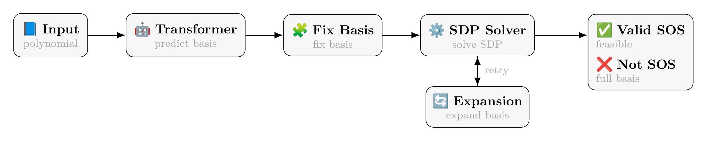

# Sum-of-Squares Transformer

<p align="center">
  <a href="https://arxiv.org/abs/2510.13444">📄 Paper</a> ·
  <a href="https://www.pelleriti.org/posts/2025/12/neural-sum-of-squares/">📝 Blog</a>
</p>

This repository is the official implementation of our ICLR 2026 paper, *Neural Sum-of-Squares: Certifying the Nonnegativity of Polynomials with Transformers*.

<p align="center">
  
</p>

*Figure 1: Overview of our approach for SOS verification: given a polynomial, a Transformer predicts a compact basis, then the basis is adjusted to ensure necessary conditions are met, and an SDP is solved with iterative expansion if needed. The method guarantees correctness: if a SOS certificate exists, it will be found; otherwise, infeasibility is certified at the full basis.*

## Overview

This codebase implements the full Neural Sum-of-Squares pipeline: synthetic dataset generation, transformer training for monomial basis prediction, and end-to-end SOS verification with cascading oracle fallback. It also includes solver configuration support (MOSEK, SCS, Clarabel, SDPA), basis repair/extension, and experiment workflows via `wandb` sweeps.

## Requirements

- Python 3.8+
- PyTorch
- CVXPY
- Weights & Biases (wandb)
- Julia 1.6+ (optional, for Julia-based SOS solving)

## Quick Start

### 1. Dataset Generation

Generate synthetic SOS polynomial datasets using predefined configurations:

```bash
# Generate dataset with specific variable count and complexity
wandb sweep sos/configs/datasets/dataset_d6_variables.yaml
wandb agent <sweep_id>
```

Key parameters in dataset config:
- `num_variables`: Number of polynomial variables (4-20)
- `max_degree`: Maximum polynomial degree
- `num_monomials`: Target basis size
- `matrix_sampler`: Matrix structure ("simple_random", "sparse", "lowrank", "blockdiag")

### 2. Model Training

Train transformer models on generated datasets:

```bash
# Train transformer model
wandb sweep transformer/config/sweeps/training.yaml
wandb agent <sweep_id>
```

Configure in `training.yaml`:
- `data_path`: Path to generated dataset
- `num_encoder_layers/num_decoder_layers`: Model architecture
- `learning_rate`, `batch_size`: Training hyperparameters

### 3. End-to-End Evaluation

Test the complete pipeline with cascading oracle approach:

```bash
# Run end-to-end evaluation
wandb sweep sos/configs/end_to_end/end_to_end_transformer.yaml
wandb agent <sweep_id>
```

## Supported Solvers

The framework supports multiple SDP solvers with configurable precision:

- **MOSEK**: Commercial solver (default, free with academic licence)
- **SCS**: Open-source conic solver
- **CLARABEL**: Rust-based interior point solver
- **SDPA**: Semi-definite programming solver

Solver configurations are defined in `sos/configs/solvers/solver_settings.jsonl`:
- `default`: Standard precision (1e-3 for MOSEK/Clarabel, 1e-8 for SCS)
- `high_precision`: Higher precision (1e-6 for MOSEK/Clarabel, 1e-10 for SCS)

## Pipeline Overview

1. **Dataset Generation**: Create synthetic SOS polynomials with known decompositions
2. **Model Training**: Train transformer to predict monomial bases
3. **Cascading Oracle**: Multi-stage approach combining transformer predictions with traditional methods

## Key Features

- **Configurable Solvers**: Support for multiple SDP solvers with precision control
- **Cascading Approach**: Combines transformer predictions with Newton polytope fallbacks
- **Basis Extension**: Automatic repair of incomplete predicted bases
- **Scalable**: Handles polynomials with up to $100$ variables and degrees up to $20$

## Citation
If you use this repository or its ideas in your research, please cite:

```bibtex
@misc{pelleriti2025neuralsumofsquares,
      title={Neural Sum-of-Squares: Certifying the Nonnegativity of Polynomials with Transformers}, 
      author={Nico Pelleriti and Christoph Spiegel and Shiwei Liu and David Martínez-Rubio and Max Zimmer and Sebastian Pokutta},
      year={2025},
      eprint={2510.13444},
      archivePrefix={arXiv},
      primaryClass={cs.LG},
      url={https://arxiv.org/abs/2510.13444}, 
}
```
